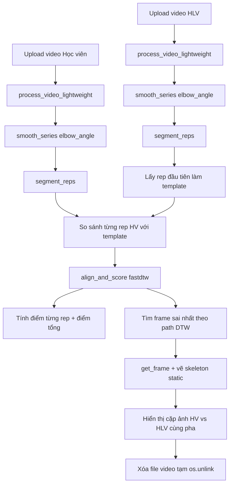

# PushUpAI

Ứng dụng Streamlit phân tích video chống đẩy theo từng rep (rep-by-rep), so sánh video học viên với template chuẩn lấy từ video huấn luyện viên.

## Cập nhật hiện tại

- Video huấn luyện viên mặc định đã được khóa cứng là `push_up_template.mp4`.
- Reference này được tiền xử lý trước bằng MediaPipe và lưu vào:
  - `cache/expert_reference.pkl`
  - `cache/expert_preview.mp4`
- Khi chạy app, hệ thống chỉ nạp cache của video mẫu và chỉ xử lý video học viên để giảm thời gian chờ.

## 1) Source code nào tham gia workflow

Workflow thực thi chỉ nằm ở các file:
- `main.py`
- `src/processor.py`
- `src/engine.py`
- `src/similarity.py`

Lưu ý:
- `__pycache__/` chỉ chứa bytecode `.pyc` đã biên dịch, không phải logic nghiệp vụ.
- `.venv/` là mã thư viện bên thứ ba, không phải source chính của dự án.

## 2) Chạy ứng dụng

```bash
pip install -r requirements.txt
.venv/bin/python scripts/precompute_reference.py --force
streamlit run main.py
```

## 3) Workflow tổng quan



---

## 4) Chi tiết workflow cho video HLV (chuyên gia)

### Bước 1: Upload file HLV
- Nhận file qua `st.file_uploader` trong `main.py`.

### Bước 2: Trích xuất đặc trưng theo frame
Gọi `VideoProcessor.process_video_lightweight(ex_file)`:

1. Tạo file tạm `.mp4` và copy buffer upload vào file tạm.
2. Mở video bằng `cv2.VideoCapture(video_path)`.
3. Duyệt toàn bộ frame bằng vòng lặp `cap.read()`.
4. **Frame sampling:** chỉ xử lý khi `curr_frame_idx % 2 == 0`.
   - Nghĩa là lấy 1 frame, bỏ 1 frame.
   - Tần suất xử lý xấp xỉ 1/2 FPS gốc.
5. Với frame được giữ lại, gọi `PoseEngine.extract_kinematics(frame)` để lấy:
   - `pose_embedding`
   - `elbow_angle`
   - `depth_sig`
   - `sig = [elbow_angle, depth_sig * 100]`
6. Lưu thêm `frame_idx` (index frame gốc trong video) để truy xuất lại ảnh sau này.
7. Trả về `ex_data` (danh sách đặc trưng) và `ex_path` (đường dẫn file tạm).

### Bước 3: Làm mượt tín hiệu góc tay
- Tạo chuỗi góc: `[d["elbow_angle"] for d in ex_data]`
- Gọi `smooth_series(...)`:
  - Nếu độ dài < 11: giữ nguyên.
  - Nếu >= 11: dùng `savgol_filter(window=11, polyorder=3)`.

### Bước 4: Tách rep của HLV
- Gọi `segment_reps(ex_angles)` để lấy danh sách `(start, end)` theo **index trên chuỗi đã sampling**.
- Bên trong dùng:
  - `inv_angles = 180 - angles`
  - `find_peaks(inv_angles, height=40, distance=15)`
  - Mở rộng biên rep theo ngưỡng `inv_angles > 20`
  - Chỉ giữ rep có độ dài `>= 5` sample.

### Bước 5: Chọn template chuẩn
- Lấy rep đầu tiên của HLV làm chuẩn vàng (`ex_reps[0]`).
- Trích:
  - `ex_template_sigs`
  - `ex_template_embs`
- Nếu không tìm thấy rep nào thì dừng với lỗi.

---

## 5) Chi tiết workflow cho video Học viên

### Bước 1: Upload file học viên
- Nhận file qua `st.file_uploader` trong `main.py`.

### Bước 2: Trích xuất đặc trưng theo frame
- Gọi `VideoProcessor.process_video_lightweight(st_file)`.
- Cơ chế giống hệt video HLV (cùng sampling, cùng hàm trích xuất).

### Bước 3: Làm mượt và tách rep
- Tạo `st_angles` từ `elbow_angle`, sau đó `smooth_series(st_angles)`.
- Tách rep bằng `segment_reps(st_angles)`.

### Bước 4: So sánh từng rep học viên với template HLV
Với mỗi rep học viên `(s_start, s_end)`:
1. Cắt chuỗi đặc trưng của rep học viên (`st_rep_sigs`, `st_rep_embs`).
2. Gọi `align_and_score(st_rep_sigs, ex_template_sigs, st_rep_embs, ex_template_embs)`:
   - Dùng `fastdtw(..., dist=euclidean)` để tìm đường khớp pha `path`.
   - Với mỗi cặp `(st_idx, ex_idx)` trong path, tính similarity bằng `compute_pose_similarity(...)`.
   - Điểm rep = trung bình similarity trên toàn path.
3. Lưu kết quả rep: số rep, score, path, range.

### Bước 5: Tính điểm tổng
- Điểm tổng buổi tập = trung bình điểm các rep học viên.

### Bước 6: Tìm frame sai nhất trong từng rep
Cho mỗi rep học viên:
1. Duyệt toàn bộ cặp chỉ số trong `path` (đã align theo pha).
2. Tính lại similarity cho từng cặp.
3. Chọn cặp có similarity thấp nhất => frame sai nhất của học viên và frame chuẩn tương ứng của HLV.
4. Nếu điểm rep < 0.8 thì gắn cảnh báo rep lỗi.

### Bước 7: Lấy ảnh gốc và vẽ skeleton
- Dùng `VideoProcessor.get_frame(video_path, frame_idx)` để lấy frame gốc theo `frame_idx` đã lưu.
- Hàm render gọi `extract_kinematics(..., is_static=True)` rồi `draw_landmarks(...)` để vẽ skeleton “dính chặt” trên ảnh.
- Hiển thị side-by-side:
  - Ảnh học viên ở frame lỗi nhất
  - Ảnh HLV cùng pha tương ứng

### Bước 8: Cleanup
- Xóa 2 file tạm bằng `os.unlink(ex_path)` và `os.unlink(st_path)`.

---

## 6) Có resize video không? Skip frame bao nhiêu?

### Resize video
- **Hiện tại không resize.**
- Không có lệnh `cv2.resize(...)` hay set width/height trong pipeline.
- Frame được đọc nguyên kích thước gốc từ `cv2.VideoCapture`.

### Skip frame
- **Có skip frame.**
- Điều kiện `curr_frame_idx % 2 == 0` nghĩa là:
  - xử lý frame 0, 2, 4, 6, ...
  - bỏ frame 1, 3, 5, ...
- Tương đương giữ khoảng 50% số frame.

---

## 7) Các hàm chính và vai trò

### `main.py`
- Điều phối toàn bộ luồng UI + phân tích.
- Tải video, gọi xử lý, tạo template, chấm điểm rep, hiển thị kết quả.

### `src/processor.py`
- `process_video_lightweight(file_buffer)`:
  - đọc video, sampling frame, gọi engine để trích đặc trưng.
- `get_frame(video_path, frame_idx)`:
  - truy xuất một frame gốc bất kỳ để hiển thị.

### `src/engine.py`
- `extract_kinematics(frame, is_static=False)`:
  - chạy MediaPipe Pose,
  - tính góc khuỷu tay trung bình,
  - tính tín hiệu độ sâu vai-hông,
  - chuẩn hóa pose embedding theo tâm hông và chiều dài thân trên.

### `src/similarity.py`
- `smooth_series(data)`: làm mượt tín hiệu.
- `segment_reps(angles)`: tách rep tự động.
- `align_and_score(...)`: căn pha bằng DTW rồi chấm điểm.
- `compute_pose_similarity(v1, v2)`: tính similarity pose có trọng số theo khớp.

---

## 8) Công thức điểm similarity hiện tại

Trong `compute_pose_similarity`:
- Trọng số mặc định mọi landmark = 1.
- Landmark tay (`11:17`) có trọng số 4.0.
- Landmark hông (`23:25`) có trọng số 2.0.
- Similarity:

```text
sim = max(0, 1 - ||(v1 - v2) * weights|| / 9.0)
```

Điểm rep là trung bình `sim` trên đường align DTW; điểm tổng là trung bình các rep.

---

## 9) Các trường hợp thực tế và hành vi hiện tại

Phần này mô tả **đúng hành vi code hiện tại**, không phải đề xuất tương lai.

### 9.1 HLV tập nhiều rep thì hệ thống chọn rep nào?

Hiện tại hệ thống luôn chọn **duy nhất rep đầu tiên** của HLV làm template:
- Tách rep của HLV bằng `segment_reps(ex_angles)`.
- Lấy `ex_reps[0]` làm chuẩn vàng.
- Mọi rep học viên đều so với template này.

Hệ quả:
- Nếu HLV có 5 rep, thì rep #2..#5 **không được dùng** để chấm.
- Nếu rep #1 của HLV chưa đẹp (khởi động, chưa xuống đúng form), điểm của học viên có thể bị lệch toàn bộ.

### 9.2 Số rep HLV và học viên khác nhau thì sao?

- Hệ thống **không yêu cầu số rep bằng nhau**.
- HLV chỉ cần có ít nhất 1 rep hợp lệ để tạo template.
- Học viên có bao nhiêu rep thì chấm bấy nhiêu rep (`for i, (s_start, s_end) in enumerate(st_reps)`).
- Mỗi rep học viên được căn pha với template HLV bằng DTW (`align_and_score`).

Các tình huống cụ thể:
- **HLV nhiều rep, học viên ít rep:** vẫn chấm bình thường (vì chỉ dùng 1 rep template của HLV).
- **HLV ít rep, học viên nhiều rep:** vẫn chấm bình thường (tất cả rep học viên so với cùng template).
- **HLV không tách được rep nào:** báo lỗi “Chuyên gia chưa thực hiện động tác chuẩn.” và dừng.
- **Học viên không tách được rep nào:** vẫn hiện `Kết quả hiệp tập: 0 Reps`, nhưng không có điểm tổng và không có phân tích chi tiết rep.

### 9.3 Video có nhiễu (đi bộ một lúc rồi mới tập) thì sao?

Hiện tại pipeline **không cắt đoạn tự động** từ lúc bắt đầu tập:
- Video được đọc từ frame đầu đến cuối.
- Không có bước “trim warm-up”, “detect start-of-exercise”, hoặc “bỏ đoạn đi bộ”.

Cơ chế ảnh hưởng:
1. **Frame-level filtering:** frame nào MediaPipe không bắt được pose thì bỏ qua.
2. **Rep detection:** rep chỉ được tạo khi chuỗi góc tay thỏa điều kiện peak (`height=40`, `distance=15`, biên `inv_angles > 20`).

Vì vậy:
- Nếu đoạn đi bộ không tạo dao động góc tay giống chống đẩy, thường sẽ **không thành rep**.
- Nếu đoạn nhiễu vô tình tạo peak giống rep, có thể phát sinh **rep giả**.

Ảnh hưởng theo từng video:
- **Nhiễu ở video HLV:** nguy hiểm hơn, vì rep đầu tiên được chọn làm template; nếu rep đầu tiên là rep giả/sai, toàn bộ điểm học viên sẽ sai theo.
- **Nhiễu ở video học viên:** có thể làm tăng số rep ảo hoặc kéo điểm tổng xuống do chấm cả rep không phải chống đẩy.

### 9.4 Có cơ chế tự loại rep xấu không?

- Hiện tại **không có** bước lọc chất lượng rep sau khi `segment_reps` (ví dụ loại rep quá ngắn, quá lệch pose so với trung bình của chính video).
- Chỉ có cảnh báo hiển thị khi điểm rep < 0.8 (🚩), nhưng rep đó vẫn được tính vào điểm tổng.

---

## 10) Tóm tắt quyết định xử lý hiện tại (as-is)

- Template HLV: dùng **1 rep đầu tiên**.
- Học viên: chấm **tất cả rep tách được**.
- Cho phép lệch số rep giữa HLV và học viên.
- Không resize video.
- Skip frame theo bước 2 (`curr_frame_idx % 2 == 0`).
- Không tự cắt đoạn nhiễu trước khi tập.
- Không tự loại rep nghi nhiễu sau khi tách rep.

Nếu cần, có thể nâng cấp thêm 3 hướng: (1) chọn template từ nhiều rep HLV, (2) auto-trim đoạn trước khi vào bài, (3) lọc rep nhiễu trước khi tính điểm tổng.
